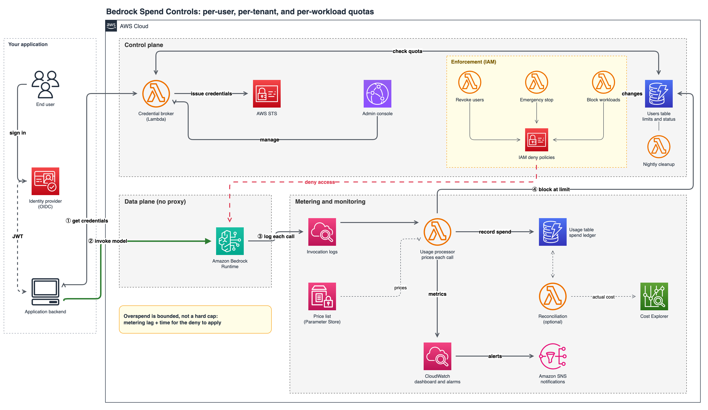
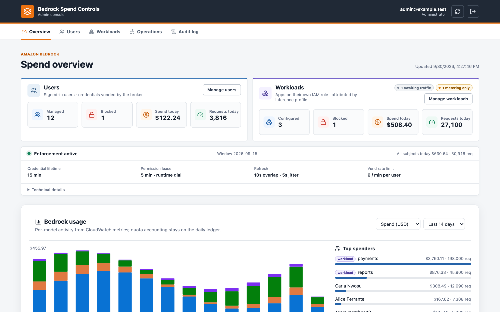
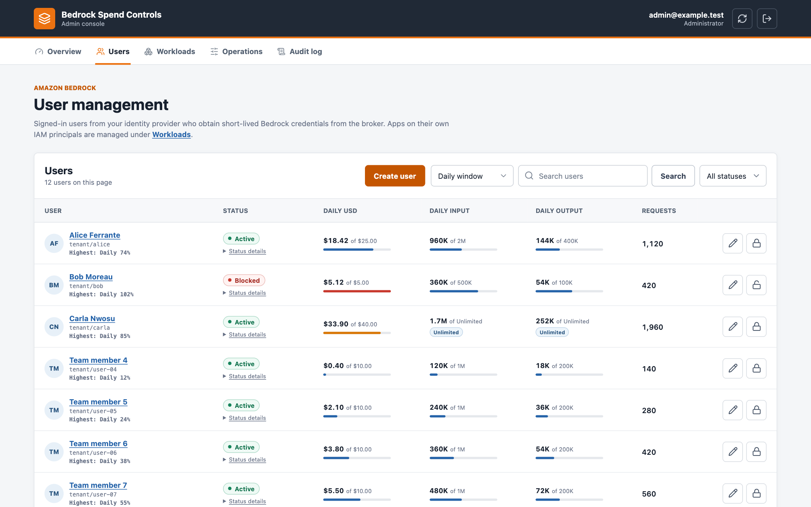
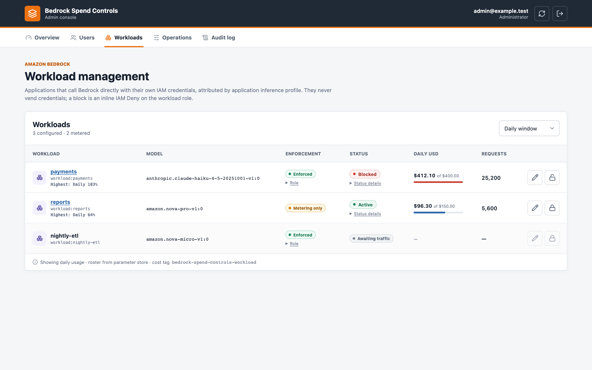
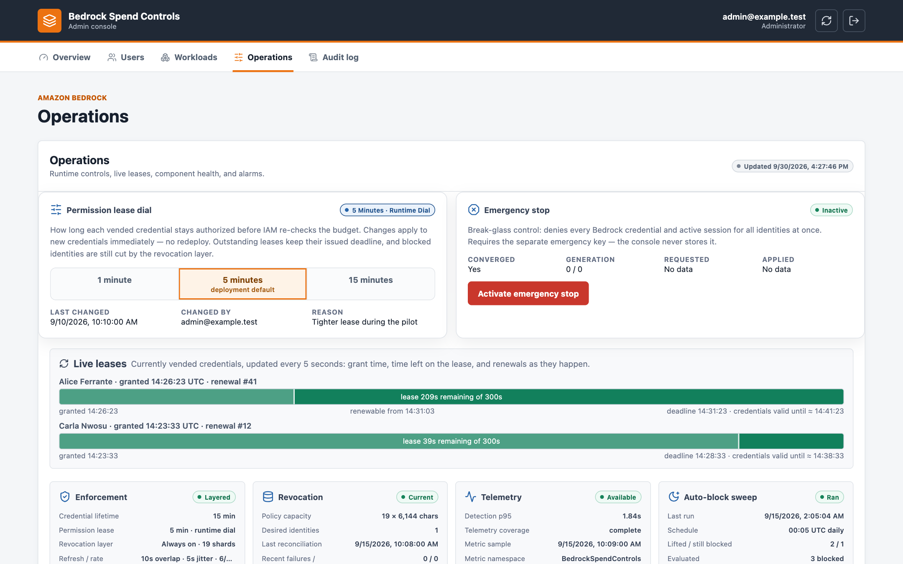

# Bedrock Spend Controls

Per-user, per-tenant, and per-workload spend quotas for Amazon Bedrock
Runtime, enforced with IAM instead of a proxy.

Applications keep calling `bedrock-runtime` directly. For per-user and
per-tenant quotas, the backend exchanges the end user's existing OIDC JWT at
a small credential broker for short-lived STS credentials that carry the
user's identity and expire when their permission lease ends; for
per-workload quotas, an application inference profile attributes the spend
and an IAM deny stops it. Every invocation is metered from Bedrock model
invocation logs into a DynamoDB ledger with daily, weekly, and monthly UTC
calendar quotas, warnings, and automatic blocks.

This is sample code for you to review, adapt, and operate; it is not a
managed AWS service.

> **This is sample code, for non-production usage.** You should work with
> your security and legal teams to meet your organizational security,
> regulatory, and compliance requirements before deployment. Deploying it
> creates AWS resources that incur charges.

## When to use it

| You want to cap | Mechanism | Change in your application |
|---|---|---|
| Each end user of an application that already authenticates with an IdP | JWT `sub` exchanged at the broker for per-user STS credentials | Replace one shared Bedrock client with one client per user (a few lines) |
| Each tenant, team, or project | The same exchange, keyed on a tenant claim (`jwt_user_claim`) | Same |
| Each internal workload that calls Bedrock with its own IAM role (batch, ETL, agents) | Application inference profile per workload plus an IAM deny on its role | Change the `modelId` string; no library |

What it is **not**:

- **Not a proxy.** Nothing sits in the inference path; prompts, streaming,
  and responses are untouched, and there is no second Bedrock endpoint.
- **Not a hard cap.** Enforcement is bounded overspend: the broker never
  sees an inference request, so a subject that crosses its limit keeps
  access until metering notices and the enforcement layers cut it.
  `overspend ≤ metering lag + min(lease remainder, deny propagation)`.
  If a workload needs a synchronous decision before every request, it needs
  a component in the data path, which this design deliberately avoids.

## Architecture



1. The backend sends the end user's JWT to the broker (SigV4-signed); the
   broker checks the quota and returns short-lived STS credentials with a
   1, 5, or 15 minute permission lease.
2. The backend calls Amazon Bedrock Runtime directly with those credentials.
3. Bedrock model invocation logs reach the usage processor through a
   CloudWatch Logs subscription; it prices each call and updates the ledger.
4. When a limit is reached the subject is blocked: the broker stops vending
   and IAM deny policies cut sessions already in flight.

Enforcement is layered and always on. Each layer can only shorten access:

| Layer | What it does | Bound |
|---|---|---|
| Permission lease | Every vended credential embeds an immutable session-policy deadline of 60, 300, or 900 s (a runtime dial, changed with `PUT /admin/enforcement`, no redeploy) | Lease remainder |
| Active-session revocation | Managed-policy shards on the vended role deny blocked `aws:SourceIdentity` values, cutting in-flight sessions before their lease ends | IAM propagation, usually seconds |
| Emergency stop | Operator-confirmed break-glass: closes vending and applies a role-wide deny | IAM propagation |

Workloads have no lease; their bound is metering lag plus IAM propagation of
the inline deny on the workload role.

| Component | Responsibility |
|---|---|
| Broker / admin API (`BrokerApiFn`) | JWT validation, quota check, lease reservation, STS vend, admin API |
| `BedrockUserRole` | The only role that can invoke models; restricted by `allowed_model_arns` and a permissions boundary |
| Users, usage, and admin-audit tables | Subjects and status; daily ledger, per-model ledger, rate counters, idempotency markers; routine audit (365 days) |
| Usage processor | Prices each invocation-log record, deduplicates by request ID, updates the ledger, warns and blocks |
| Enforcement dispatcher | Fans users-table stream changes out to the revocation processor and workload enforcer |
| Revocation processor | Converges the 19 deny shards onto the set of blocked identities |
| Workload enforcer | Attaches and removes the inline deny on workload roles |
| Emergency processor | Converges the role-wide emergency deny |
| Auto-block sweeper | Nightly lift of automatic blocks for users who never vend again |
| Reconciliation processor (opt-in) | Daily ledger-vs-Cost-Explorer comparison, aggregate and per workload |
| Admin console | Overview, Users, Workloads, Operations, Audit |

The editable diagram is [`assets/architecture.drawio`](assets/architecture.drawio)
(page 1 runtime architecture, rendered above as
[`assets/architecture.png`](assets/architecture.png); page 2 data flow with
the seven trust boundaries used by the threat model, rendered as
[`assets/data-flow.png`](assets/data-flow.png)).

## Prerequisites

- An AWS account with Amazon Bedrock model access in the target Region.
- AWS CLI with an authorized profile; permission to bootstrap and deploy CDK.
- Node.js and npm (CDK CLI and the admin console build).
- Python 3.12 or later on the deploy host with `pip3` available. The broker
  is bundled on the host with pinned manylinux wheels; Docker or Finch is
  used only as an automatic fallback (`CDK_DOCKER=finch` for Finch).
- For the integration library in your application: Python 3.10 or later,
  `boto3`, `httpx`.

## Quick deploy (demo)

The demo configuration creates its own Cognito user pool, manages invocation
logging for the Region, hosts the admin console, and auto-provisions users
with a $1/day default. Use a personal or sandbox account.

```bash
git clone https://github.com/aws-samples/sample-bedrock-spend-controls.git
cd sample-bedrock-spend-controls/admin-ui
npm ci && npm run build

cd ../cdk
python3 -m venv .venv
.venv/bin/pip install -r requirements.txt
npm ci

export AWS_PROFILE=your-profile
export AWS_REGION=us-east-1
export AWS_DEFAULT_REGION=$AWS_REGION

aws sso login --profile "$AWS_PROFILE"      # SSO profiles only
npx cdk bootstrap
npx cdk synth  -c deployment_config=config/demo.json -c alert_email=you@example.com
npx cdk deploy -c deployment_config=config/demo.json -c alert_email=you@example.com
```

Then follow [DEPLOYMENT.md](DEPLOYMENT.md) to read the outputs, create the
demo administrator, and run the smoke tests. The same guide covers the
production path: your IdP, centrally managed logging, exact model ARNs, and
the SCP that prevents bypass.

## Integrate your application

The stack is deployed once. Your backend, IdP, and inference code stay where
they are; what changes is where the backend gets its Bedrock credentials.

**Per user:** replace the shared client with one client per user.

```python
# before
bedrock = boto3.client("bedrock-runtime")

def handle_chat(request):
    user = verify_jwt(request.jwt)
    return bedrock.converse(modelId=MODEL, messages=request.messages)
```

```python
# after: one factory per process, one line per request
from refreshable_bedrock import BedrockSpendControls, QuotaExceededError, UserBlockedError

spend_controls = BedrockSpendControls(BROKER_API_URL, region="us-east-1")

def handle_chat(request):
    user = verify_jwt(request.jwt)                      # unchanged
    bedrock = spend_controls.client_for(request.jwt)    # new
    try:
        return bedrock.converse(modelId=MODEL, messages=request.messages)  # unchanged
    except QuotaExceededError as exc:
        return http_429(f"Quota exhausted, resets at {exc.resets_at:%H:%M} UTC")
    except UserBlockedError:
        return http_403("Your Bedrock access is blocked")
```

`client_for` returns an ordinary boto3 client. The factory keeps one lease
per identity, vends lazily on the first Bedrock call, renews before the
lease ends, and forgets idle identities. The broker request is SigV4-signed
with the backend's own role, which must be in `invoker_principal_arns`.

**Per workload:** change one string.

```python
# before
bedrock.converse(modelId="us.anthropic.claude-haiku-4-5-20251001-v1:0", ...)
# after: the workload's application inference profile from the stack outputs
bedrock.converse(modelId=os.environ["BEDROCK_PROFILE_ARN"], ...)
```

The operator lists the workload and its role ARN in
`cdk/config/workloads.json` and redeploys. When the budget is exhausted,
Bedrock returns `AccessDeniedException` until every enabled period is under
quota again.

The developer guide, [docs/integration.md](docs/integration.md), covers
middleware binding, multi-instance backends, error handling, the
`/v1/credentials` contract for other languages, and the workload path in
detail.

## How quotas work

- A quota belongs to a **subject**: the JWT claim value, or
  `workload:<name>`.
- Each subject can enable `daily`, `weekly`, and `monthly` periods
  independently. Windows are fixed UTC calendars (00:00 UTC; Monday; the
  1st), not rolling intervals. Every enabled period is evaluated on every
  vend and every metered invocation.
- A period sets `usd`, `input_tokens`, and `output_tokens`. `0` means
  **Unlimited** for that dimension; `null` disables the period.
- Each period carries an ordered `thresholds` list of `warn` and `block`
  levels. One SNS warning is sent per `warn` level per window; the subject
  is blocked at the `block` level, which may sit above 100 %. A list with no
  `block` entry is an **alert-only** budget.
- Optional **rate limits** (`rpm`, `tpm`) count metered requests and uncached
  tokens per UTC minute and block through the same automatic path.
- Optional **per-model budgets** cap one model inside the subject's total.
  Known limitation: a model budget breach blocks the whole subject, because
  enforcement acts on the identity, not the model.
- Automatic blocks lift by themselves once every enabled period is under
  quota again: at the next vend, on the workload enforcer's pass, or in the
  nightly sweep. Admin blocks never lift automatically.

Details, including why weekly and monthly totals read at most 37 daily rows:
[docs/quotas.md](docs/quotas.md).

## Operate

The admin console has five tabs: **Overview** (users and workloads side by
side, per-model usage charts), **Users** (paginated list, create, limits,
thresholds, rate limits, block and unblock, detail drawer with usage history,
audit, and per-model budgets), **Workloads** (the deployed roster with its
enforcement state), **Operations** (enforcement configuration, the runtime
lease dial, emergency stop, live leases, auto-block sweep, reconciliation,
alarm chips), and **Audit** (global admin audit).

The screenshots below come from the console's local preview harness
(`admin-ui/preview/`), which runs against fictitious users and data.

| Overview | Users |
|---|---|
|  |  |
| **Workloads** | **Operations** |
|  |  |

The same API is reachable from the SigV4 admin CLI:

```bash
python examples/sigv4_gateway.py --gateway-url "$BROKER_API_URL" \
  --profile "$AWS_PROFILE" --region "$AWS_REGION" --admin-key "$ADMIN_KEY" \
  create-user alice --daily-usd 5 --daily-input-tokens 1000000 --daily-output-tokens 200000 \
  --daily-thresholds "50:warn,80:warn,100:block" --rpm 60 --tpm 100000
```

Every deployment creates eight CloudWatch alarms (ten with workloads and
reconciliation configured), all notifying the `QuotaAlerts` SNS topic and
each with a runbook under [docs/runbooks/](docs/runbooks/README.md), as does
every Lambda component. Warnings and blocks go to the same topic.

Console tabs, the lease dial, the emergency-stop state machine, CLI
commands, safe-write rules: [docs/operations.md](docs/operations.md).
Route-by-route reference: [docs/admin-api.md](docs/admin-api.md).

## Cost

Per-user CloudWatch metrics dominate the solution's own running cost: every
active user adds about eleven metric streams per month. The estimate is about
$365/month for the demo scenario (100 users) and about $3,100/month at 1,000
users, of which everything other than custom metrics is under $25. Dropping
the `UserId` dimension from the EMF metrics is the single change that
matters before running at hundreds of users. Assumptions, line items, and
reduction options: [docs/cost-estimate.md](docs/cost-estimate.md). Bedrock
inference spend itself is what the solution meters and is not included.

## Security

- The broker Function URL is `AWS_IAM`; only `invoker_principal_arns` can
  call it, and the broker role cannot invoke a model.
- The vended role receives only Runtime actions on `allowed_model_arns`,
  capped by a managed permissions boundary. Lease session policies can only
  narrow it further.
- The revocation and emergency processors can version only their designated
  pre-attached policies; they cannot edit the role, its trust policy, or the
  boundary.
- No Bedrock bearer keys are vended: `bedrock:CallWithBearerToken` requires
  `Resource: "*"` and would defeat the model allowlist.
- The console never receives the shared admin key or the emergency key.

**Quotas only hold if no other principal can call Bedrock directly.**
Production applies an SCP (example in [DEPLOYMENT.md](DEPLOYMENT.md#5-prevent-bypass)),
a permissions boundary, or the stack's `DenyDirectBedrockPolicyArn`.

**Unmetered APIs.** Model invocation logging captures `InvokeModel`,
`InvokeModelWithResponseStream`, `Converse`, `ConverseStream`, and the
OpenAI-compatible endpoints. `StartAsyncInvoke` (async video and image
generation) and `InvokeModelWithBidirectionalStream` (speech to speech)
authorize under the same IAM actions but are not logged, so their spend
never reaches the ledger; keep such models out of `allowed_model_arns` if
strict accounting matters. The `bedrock-mantle` endpoint is a separate IAM
prefix that vended sessions cannot reach, but any other principal with
`bedrock-mantle:*` spends unmetered; the SCP example denies both prefixes.

The STRIDE review of the seven trust boundaries, with 31 threats, mitigations,
and code references, is [docs/threat-model.md](docs/threat-model.md)
([Threat Composer export](docs/threat-model.tc.json)). Account and
organization administrators can still change IAM and SCPs; the sample cannot
constrain the management plane.

## Clean up

```bash
cd cdk
npx cdk destroy -c deployment_config=config/demo.json
```

With `retain_tables_on_delete: true` (the production default) the DynamoDB
tables survive deletion. Stack-managed invocation logging (the
configuration, writer role, and log group) is always retained because the
previous account-wide setting cannot be reconstructed. Remove retained
resources only through an explicit data-retention decision.

## Repository layout

| Path | Purpose |
|---|---|
| `cdk/` | CDK app, validated deployment configuration, price catalog, and the deploy-time price resolver |
| `gateway/` | Broker and admin API (FastAPI on Lambda Web Adapter) |
| `usage_processor/` | Invocation-log subscription consumer: pricing, ledger, warnings, blocks |
| `enforcement_dispatcher/` | Users-table stream consumer that fans out to the enforcement Lambdas |
| `revocation_processor/` | Sharded per-identity IAM deny reconciler |
| `workload_enforcer/` | Inline IAM deny convergence for workload roles |
| `emergency_processor/` | Operator-controlled role-wide deny controller |
| `auto_block_sweeper/` | Nightly lift of stale automatic blocks |
| `reconciliation_processor/` | Daily ledger-vs-Cost-Explorer comparison |
| `quota_periods_layer/` | Lambda layer shared by the broker and processors: calendar windows, thresholds, row evaluation |
| `admin-ui/` | Static React admin console |
| `examples/` | `refreshable_bedrock.py` (the `BedrockSpendControls` client factory and credential provider) and `sigv4_gateway.py` (admin CLI) |
| `qualification/` | Guarded probes to measure enforcement latency in your own account, and the evidence template |
| `tools/` | Price-catalog export, unpriced-usage report, cost estimate, threat-model export, diagram rendering |
| `assets/` | Architecture and data-flow diagrams (draw.io source and PNG renders), admin console screenshots |
| `docs/` | Quotas, pricing, configuration, operations, admin API, integration guide, runbooks, threat model, cost estimate |
| `tests/` | Unit, API, infrastructure, probe, pricing, and threat-model consistency tests |

## Running the tests

```bash
python -m pytest tests/ -q
(cd admin-ui && npm ci && npm test && npm run build)
(cd cdk && for c in demo production; do
  npx cdk synth --app "python app.py" -c deployment_config=config/$c.json --quiet
done)
```

Static analysis (`semgrep` with `p/security-audit`, `p/secrets`, `p/jwt` and
the language rulesets, `bandit`, `gitleaks`) reports no security findings.
Three classes of advisories are expected and accepted: `jsx-not-internationalized`
(the console is a single-locale sample), `dynamic-urllib-use-detected` on the
two `urlopen` calls whose URL is checked to be `https://` first, and
`return-in-init` / `return-not-in-function`, a parser false positive on
`lambda:` expressions used as dataclass `default_factory`.

## Third-party dependencies

The repository includes no third-party code, fonts, images, or datasets; all
third-party software is **referenced** through pinned manifests and fetched
by the tools you run:

| Manifest | Used by | Licenses (direct and transitive) |
|---|---|---|
| `gateway/requirements.txt` | Broker Lambda (bundled into the deployment asset on your deploy host) | MIT, BSD-2/3-Clause, Apache-2.0, MIT-0, PSF-2.0 (`typing_extensions`) |
| `cdk/requirements.txt`, `cdk/package.json` | CDK app and CLI | Apache-2.0, MIT |
| `admin-ui/package.json` | Admin console build (runtime: React, AWS SDK for JavaScript, aws4fetch, lucide-react) | Runtime: MIT, Apache-2.0, ISC, 0BSD. Build/test only: also MIT-0 and CC-BY-4.0 (`caniuse-lite` browser data) |
| `examples/refreshable_bedrock.py` (`boto3`, `httpx`) | Your application | Apache-2.0, BSD-3-Clause, MIT; `httpx` pulls in `certifi` (MPL-2.0) |

The broker also attaches the public
[AWS Lambda Web Adapter](https://github.com/awslabs/aws-lambda-web-adapter)
layer (Apache-2.0) by ARN. Review these licenses against your own policies
before you redistribute a built artifact.

## Contributing and license

See [CONTRIBUTING](CONTRIBUTING.md#security-issue-notifications) for more
information, including how to report security issues, and the
[CODE_OF_CONDUCT](CODE_OF_CONDUCT.md).

This sample code is licensed under the MIT-0 License. See the
[LICENSE](LICENSE) file.
